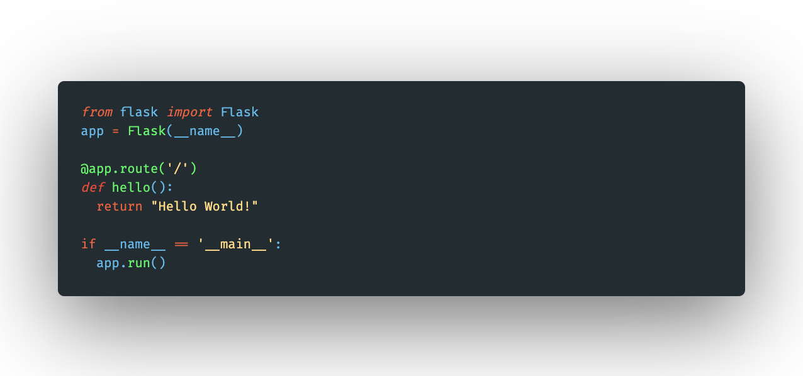
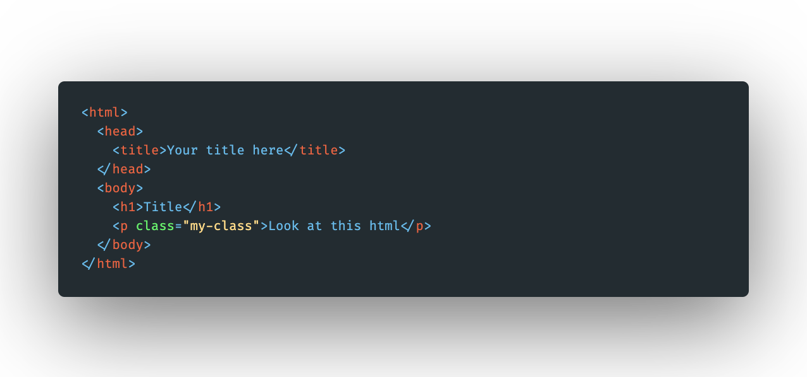
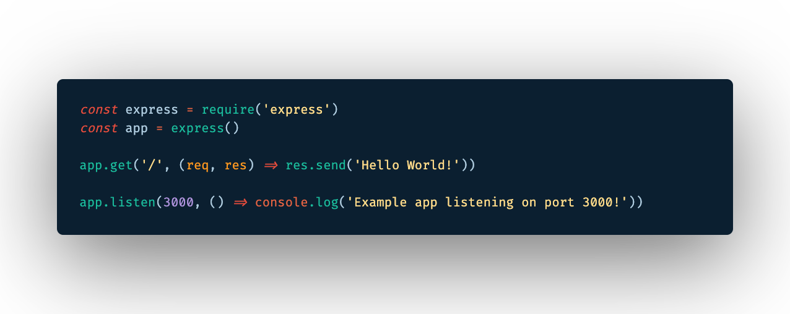
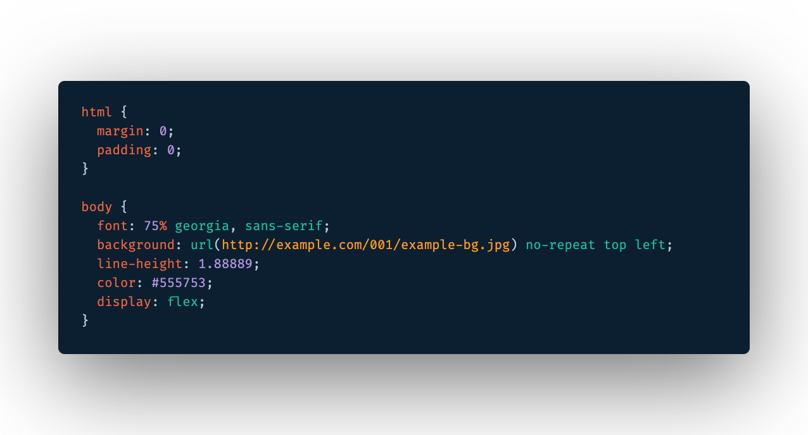
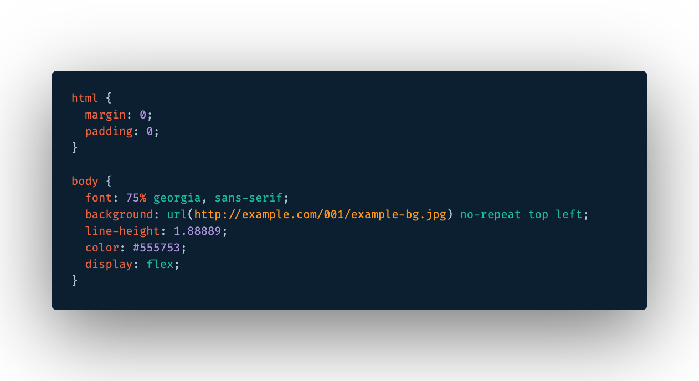

# Pyjamas VS Code Dark Theme
Based on the FlatUI theme from [danibram](https://github.com/danibram/flat-ui-syntax-vscode).

## Screenshots

The font show in the screenshots below is [Fira Code](https://github.com/tonsky/FiraCode). To activate ligatures see [this guide](https://github.com/tonsky/FiraCode/wiki/VS-Code-Instructions).

### Default Theme

### GUI

### Javascript

### Python

### HTML

### CSS

### Blue Theme

This package also contains a blue variant as shown below.

### GUI

### Javascript

### Python

### HTML

### CSS

