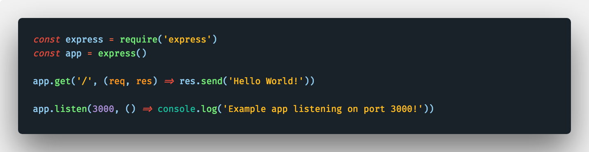

# Pyjamas VS Code Dark Theme
Based on the FlatUI theme from [danibram](https://github.com/danibram/flat-ui-syntax-vscode).

## Screenshots
The font show in the screenshots below is [Fira Code](https://github.com/tonsky/FiraCode). To activate ligatures see [this guide](https://github.com/tonsky/FiraCode/wiki/VS-Code-Instructions).
#### GUI

#### Javascript

#### Python

#### HTML

#### CSS
